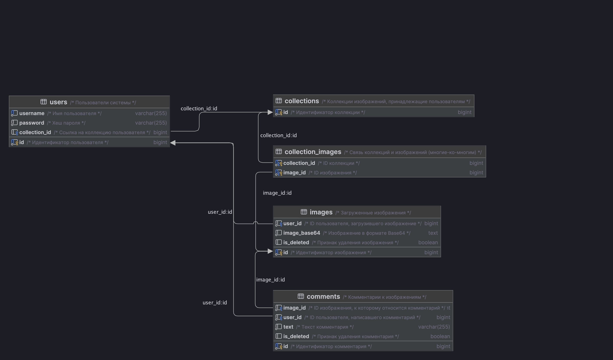

# Picture – Платформа для управления изображениями

## Содержание

- [Описание](#описание)
- [Архитектура](#архитектура)
- [Структура данных](#структура-данных)
- [Запуск проекта](#запуск-проекта)
- [Настройки Nginx](#настройки-nginx)
    - [Общие настройки](#общие-настройки)
    - [Доступ к API](#доступ-к-api)
    - [Доступ к pgAdmin](#доступ-к-pgadmin)
    - [Мониторинг](#мониторинг)
- [Redis Insight](#redis-insight)
- [Swagger документация](#swagger-документация)
- [Описание API](#описание-api)
    - [Сервис Пользователей](#сервис-пользователей)
    - [Сервис Изображений](#сервис-изображений)
    - [Сервис Комментариев](#сервис-комментариев)
    - [Шлюз](#шлюз)
- [Интеграционные тесты](#интеграционные-тесты)

## Описание

**Picture** — это RESTful API-платформа на основе микросервисной архитектуры для управления пользователями,
изображениями и комментариями.  
Проект реализован на **Java 21** с использованием **Spring Boot** и придерживается архитектурных принципов **SOLID**, **DRY**, **KISS** и паттерна **MVC**.

### Особенности

- **Микросервисная архитектура** с API-шлюзом.
- **Регистрация и авторизация пользователей** (JWT).
- **Хранение изображений** в формате Base64.
- **Добавление и удаление комментариев** к изображениям.
- **Использование Redis** для кэширования данных в микросервисах **User Service**, **Image Service**, **Comment Service**.
- **Redis Insight** для мониторинга и анализа Redis в рабочем режиме.
- **Swagger UI** для ручного тестирования API.
- **Паттерны отказоустойчивости**:
    - Circuit Breaker и Retry для GET-запросов.
    - Полный откат операции при сбое одной из систем.
- **Healthcheck endpoints** для всех сервисов.
- **Интеграционные и модульные тесты**.

## Архитектура

Система состоит из 4 микросервисов:

1. **User Service** — управление пользователями и их коллекциями изображений.
2. **Image Service** — загрузка, удаление и получение изображений.
3. **Comment Service** — добавление, удаление и получение комментариев.
4. **Gateway Service** — единая точка входа, маршрутизация и оркестрация запросов.

## Структура данных

База данных для сервиса схематически выглядит так:


## Запуск проекта

Перед запуском проекта необходимо настроить локальные доменные имена picture.ru и www.picture.ru, чтобы они указывали на
ваш
компьютер (локальный сервер).  
Для этого добавьте в файл hosts следующую запись:

```bash
127.0.0.1 picture.ru www.picture.ru
```

🔗 [Настройка hosts на macOS](https://help.reg.ru/support/dns-servery-i-nastroyka-zony/rabota-s-dns-serverami/fayl-hosts-na-macos#0)  
🔗 [Настройка hosts на Windows](https://help.reg.ru/support/dns-servery-i-nastroyka-zony/rabota-s-dns-serverami/fayl-hosts-dlya-windows-10#0)

Проект может быть запущен в Docker-контейнере с помощью команды:

```bash
docker compose up --build
```

## Настройки Nginx

### Общие настройки

- Nginx настроен на работу по HTTPS.
- Включено gzip-сжатие.

### Доступ к API

- Основной API: https://picture.ru/api/ — доступны все эндпоинты через Шлюз.

### Доступ к pgAdmin

- URL: https://picture.ru/admin
- Логин: pgadmin@example.com
- Пароль: admin

### Мониторинг

- По пути https://picture.ru/api/status доступен статус сервера Nginx.

## Redis Insight

Для мониторинга Redis используется Redis Insight.  
Для доступа к Redis Insight UI используйте: https://picture.ru/redis-insight

## Swagger документация

После запуска проекта API поддерживает документацию Swagger.   
Для доступа к Swagger UI используйте: https://picture.ru/api/swagger  
После открытия страницы в поисковике введите /api-docs/swagger-config и нажмите Explore.

## Описание API

### Сервис Пользователей

- **GET http://127.0.0.1:8080/api/v1/users?limit={int}&skip={int}** - Метод получения всех пользователей с пагинацией.
- **DELETE http://127.0.0.1:8080/api/v1/users/{user_id}/collections** - Метод удаления изображения из коллекции пользователя.
- **POST http://127.0.0.1:8080/api/v1/users/{user_id}/collections** - Метод добавления изображения в коллекцию пользователя.
- **GET http://127.0.0.1:8080/api/v1/users/authorization** - Метод проверки авторизации.
- **POST http://127.0.0.1:8080/api/v1/users/authorization** - Авторизация пользователя через jwt-токены.
- **POST http://127.0.0.1:8080/api/v1/users/registration** - Метод регистрации пользователя (на вход подается json, соответствующей структуре, описанной
  ниже).
  ```json
  {
  "username": string,
  "password": string
  }

- **Валидация**: Все обязательные поля (username, password) должны быть указаны. В случае ошибки валидации возвращается код ошибки 400.

### Сервис Изображений

- **GET http://127.0.0.1:8080/api/v1/images/{image_id}** - Метод получения изображения.
- **DELETE http://127.0.0.1:8080/api/v1/images/{image_id}** - Метод удаления изображения.
- **POST http://127.0.0.1:8080/api/v1/images** - Метод добавления (загрузки) нового изображения (на вход подается json, соответствующей структуре,
  описанной ниже).
  ```json
  {
    "image_base64": string, 
    "user_id": int
  } 
- **Валидация**: Все обязательные поля (image_base64, user_id,) должны быть указаны. В случае ошибки валидации возвращается код ошибки 400.

### Сервис Комментариев

- **DELETE http://127.0.0.1:8080/api/v1/images/{image_id}/comments/{comment_id}** - Метод удаления комментария к изображению.
- **GET http://127.0.0.1:8080/api/v1/images/{image_id}/comments/{comment_id}** - Метод получения конкретного комментария к изображению.
- **GET http://127.0.0.1:8080/api/v1/images/{image_id}/comments** - Метод получения всех комментариев к изображению.
- **POST http://127.0.0.1:8080/api/v1/images/{image_id}/comments** - Метод добавления комментария к изображению (на вход подается json, соответствующей структуре,
  описанной ниже).
  ```json
  {
    "comment_text": string, 
    "user_id": int
  }  


### Шлюз

- **POST https://www.picture.ru/api/registration** - Метод регистрации пользователя.
- **POST https://www.picture.ru/api/authorization** - Метод авторизации пользователя.
- **GET https://www.picture.ru/api/users** - Метод получения всех пользователей с пагинацией.
- **GET https://www.picture.ru/api/users/{user_id}/collections** - Метод получения коллекции пользователя.
- **POST https://www.picture.ru/api/users/me/collections** - Метод добавления изображения в свою коллекцию.
- **DELETE https://www.picture.ru/api/users/me/collections** - Метод удаления изображения из своей коллекции.
- **GET https://www.picture.ru/api/images/{image_id}** - Метод получения изображения.
- **POST https://www.picture.ru/api/images/{image_id}/comments** - Метод добавления комментария к изображению.
- **GET https://www.picture.ru/api/images/{image_id}/comments** - Метод получения всех комментариев к изображению.
- **DELETE https://www.picture.ru/api/images/{image_id}/comments/{comment_id}** - Метод удаления своего комментария к изображению.


## Интеграционные тесты

Для ручных проверок API в директории data-samples подготовлена коллекция Postman для всех эндпоинтов.  
Реализованы интеграционные тесты, которые проверяют работоспособность API для каждого эндпоинта.  
Для запуска интеграционных тестов используется команда:

```bash
gradle test
```